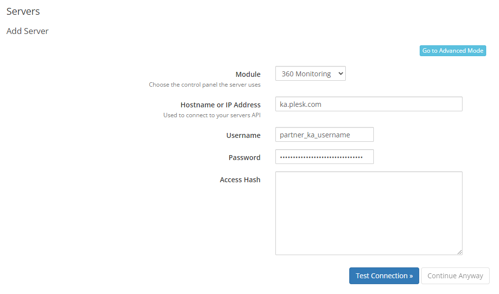
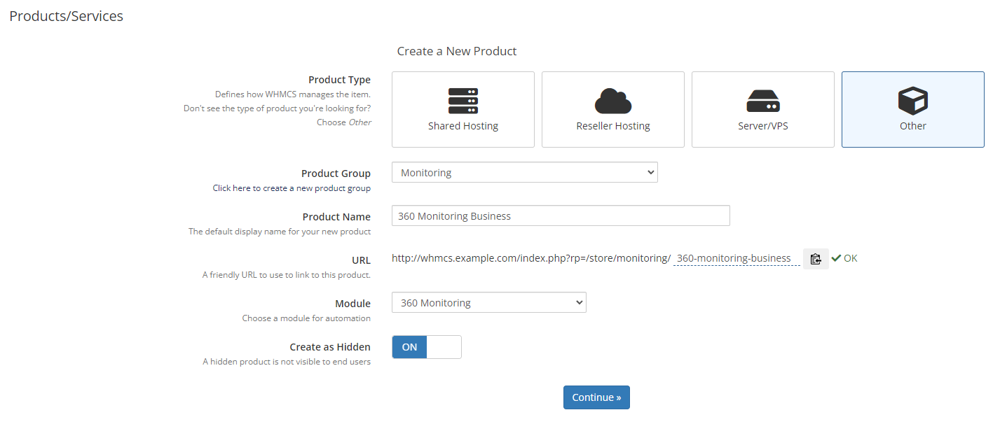
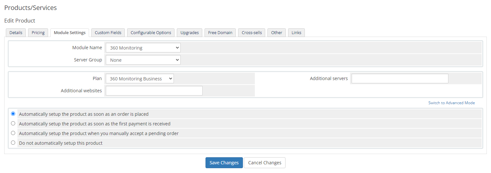
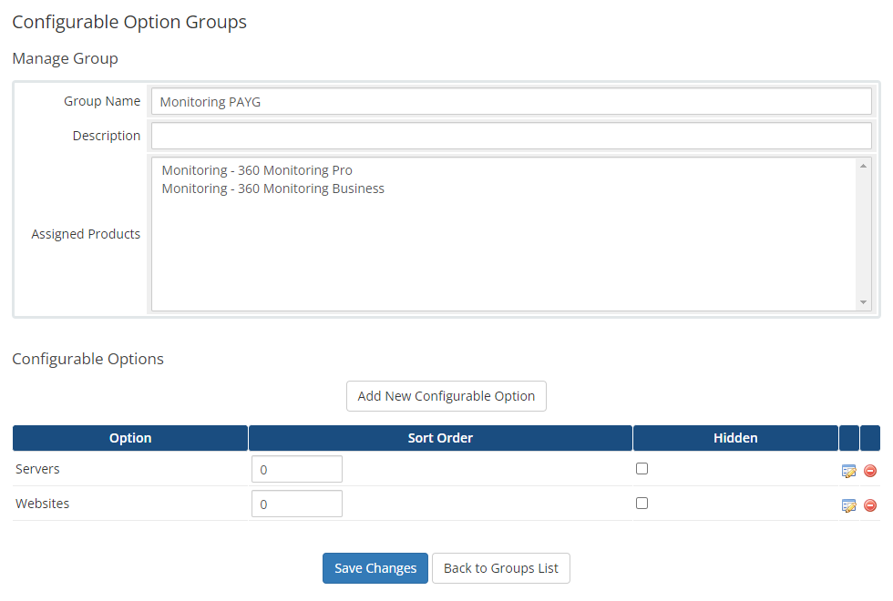
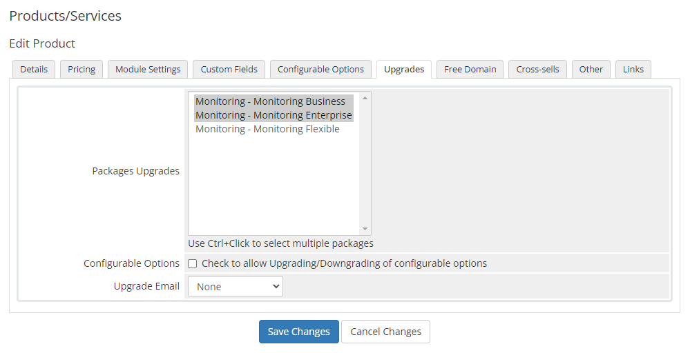

# 360 Monitoring WHMCS provisioning module

## Description

360 Monitoring WHMCS provisioning module gives the ability to sell the site and server monitoring solution.

## 360 Monitoring Plans

The module supports the following 360 Monitoring plans:

|          | Pro | Business | Enterprise | Flexible |
| -------- | --- | -------- | ---------- | -------- |
| Servers  |  1  | 10       | 100        | 0        |
| Websites | 20  | 200      | 2000       | 0        |

In addition to the monitors included in the plan, an additional amount of monitors can be set in the product options.

## Requirements

The minimum required PHP version is 7.4.

For the latest WHMCS minimum system requirements, please refer to <https://docs.whmcs.com/System_Requirements>.

## Installation

* Download the latest zip archive from the [releases page](https://github.com/plesk/whmcs-360monitoring/releases)
* Extract the contents of the zip file in the WHMCS root directory; the module will be extracted to `/modules/servers/p360monitoring`
* Remove the zip file afterward

## Server setup

The module uses the Plesk Key Administrator Partner API 3.0. To configure the module, go to Products/Services -> Servers and add a new server with the credentials:

## Product setup

After server setup is done, go to Products/Services and add a new product group e.g. `Monitoring`. Then create a new product:

and configure it further in the Module Settings:

The `White label domain` field is optional and can be used to set the domain name for the white label monitoring URL. If the domain name is not specified, the default 360 Monitoring URL will be used.

The `Additional servers` and `Additional websites` fields are optional and can be left empty, except for the Flexible plan.

To allow the customer to choose additional monitors (pay-as-you-grow model), go to the Configurable Options, and add a new group with two options inside, named `Servers` and `Websites` respectively and assign them to the relevant products:

## Product upgrades/downgrades

You can also configure product upgrades, but it is only allowed to upgrade from a lower plan to a higher plan (e.g. Pro -> Business -> Enterprise). A downgrade from the higher plan to a lower plan (e.g. Business -> Pro) is restricted by the Plesk Key Administrator.

## Email template customization

The 360 Monitoring license can be activated through the client area or by sending the activation link in the "New Product Information", which by default is the "Other Product/Service Welcome Email". To do so:

* Go to Configuration -> Email Templates
* Edit the "Other Product/Service Welcome Email" in the "Product/Service Messages" group
* Add the placeholder `{$service_custom_field_activationurl}` to the template, e.g. `{if isset($service_custom_field_activationurl)}If not already done please activate the product here: {$service_custom_field_activationurl}{/if}`

## Troubleshooting

In case of problems look at the System Logs -> Module Log.

## Copyright

Copyright 2024. [WebPros International GmbH](https://webpros.com). All rights reserved.
